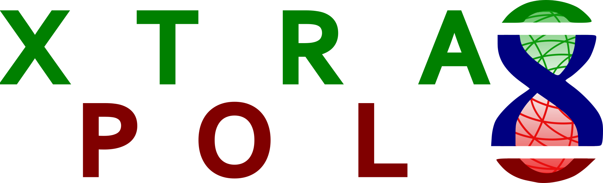

<!-- PROJECT LOGO -->
<br />
<p align="center">
  <a href="https://github.com/ElkeDeZitter/Xtrapol8">
    
  </a>

  <p align="center">
    Structural analysis of low occupancy states
  </p>
</p>


<!-- TABLE OF CONTENTS -->
<details open="open">
  <summary>Table of Contents</summary>
  <ol>
    <li>
      <a href="#xtrapol8">Xtrapol8</a>
    </li>
    <li>
      <a href="#getting-started">Getting Started</a>
      <ul>
        <li><a href="#prerequisites">Prerequisites</a></li>
        <li><a href="#installation">Installation</a></li>
      </ul>
    </li>
      <a href="#Usage">Usage</a></li>
      <ul>
        <li><a href="#Command-line-usage">Command line usage</a></li>
        <li><a href="#Graphical-User-Interface-usage">Graphical User Interface usage</a></li>
      </ul>
    <li><a href="#license">License</a></li>
    <li><a href="#contact">Contact</a></li>
  </ol>
</details>


<!-- ABOUT THE PROJECT -->
## Xtrapol8

<!-- [![Product Name Screen Shot][product-screenshot]](https://example.com) -->

Xtrapol8 is software for the calculation of Fourier difference maps, extrapolated structure factor ampltiudes (ESFAs) and estimation of the occupancy of at triggered state that occupies the crystal at low occupancy. It is based on the cctbx toolbox and uses some CCP4 programs. In order to run Xtrapol8, you will need to have a proper licence for Phenix and CCP4 and have both software suites installed. Please use Phenix 1.19 or higher.

An introduction into Fourier difference maps, structure factor extrapolation and the software itself can be found on the [youtube channel of CCP4](https://www.youtube.com/watch?v=H21L3-M_ge4)

If Xtrapol8 was useful in your project, please cite us: De Zitter, E., Coquelle, N., Oeser, P., Barends, T. R. M., Colletier, J.-P., [Xtrapol8 enables automatic elucidation of low-occupancy intermediate-states in crystallographic studies](https://doi.org/10.1038/s42003-022-03575-7), Communications Biology, 5(1):640, 2022. 

## New in version 1.2.0
* Untreated extrapolated electron density maps ("keep_no_fill") are now automatically added to the output, allowing easy comparison of negative_and_missing strategies. 
* Resolution boundaries for scaling can be specified.

See release notes and manual for more info and other new features.

<!-- GETTING STARTED -->
## Getting Started

Xtrapol8 uses no external modules in addition to standard python and those from cctbx (which comes with Phenix). It also uses some programs from CCP4. This means that you have CCP4 and Phenix, you are ready to go. Follow the steps below to make sure that Xtrapol8 can find what it needs.

### Prerequisites

You need the [ccp4](https://www.ccp4.ac.uk) and [Phenix](https://www.phenix-online.org) software suites, and both should be setup via the command line. Below you find a detailed description on how to setup CCP4 and phenix correctly for Xtrapol8 using a terminal on Mac:
1. Add Phenix and the cctbx modules to your PATH: Source the file phenix_env.sh folder (you can use Finder to find out which Phenix version you have installed and where to find phenix_env.sh):
   ```sh
   source /Applications/phenix-1.19.1-4122/phenix_env.sh
   ```
2. Add CCP4 to your PATH: In the same terminal source ccp4.setup-sh (again you can use Finder to find out which CCP4 version you have installed and where to find phenix_env.sh):
   ```sh
   source /Applications/ccp4-7.1/bin/ccp4.setup-sh
   ```
3. Check if Phenix and CCP4 programs can be found (you should get the paths in return):
   ```sh
   which phenix.refine
   which scaleit
   ```
* You can add step 2 and 3 to your ~/.profile, ~/.zprofile or ~/.bashrc file if you want to avoid doing these steps each time you open a new terminal. Using your favorite editor (e.g. nano):
   ```sh
   nano ~/.zprofile
   #Setting Phenix and ccp4
   source /Applications/phenix-1.19.1-4122/phenix_env.sh
   source /Applications/ccp4-7.1/bin/ccp4.setup-sh
   ```
   
### Installation

Clone or download the Xtrapol8 repository. Take care that all files are stored in the same directory (don't move any file).
   ```sh
   git clone https://github.com/ElkeDeZitter/Xtrapol8.git
   ```
Or click on "Code" -> "Download ZIP" on the top.

<!-- USAGE EXAMPLES -->
## Usage
### Command line usage

Upon running Xtrapol8 without arguments, you get the full list of arguments that can be added using an input file or via command line arguments:
   ```sh
   phenix.python <folder/to/Xtrapol8>/Fextr.py
   ```
   
* You can add Xtrapol8 to your path for easier accessibilty, otherwise you just memorize where you've put it
   ```sh
   nano ~/.zprofile
   alias 'X8=phenix.python <folder/to/Xtrapol8>/Fextr.py'
   ```
   
An example input file with all changeable parameters can be found in the [example](https://github.com/ElkeDeZitter/Xtrapol8/blob/main/Xtrapol8_example.phil) or in the [minimal_input](https://github.com/ElkeDeZitter/Xtrapol8/blob/main/Xtrapol8_minimal.phil)

* Example using input file:
  1. Change the Xtrapol8.phil using your favorite text editor:
   ```sh
   nano Xtrapol8.phil
   ```
  2. Run Xtrapol8
  ```sh
  phenix.python <folder/to/Xtrapol8>/Fextr.py Xtrapol8.phil
  ```
* example using command line argument only:
  ```sh
  phenix.python <folder/to/Xtrapol8>/Fextr.py input.reference_mtz=hiephiep.mtz input.triggered_mtz=hieperdepiep.mtz input.model_pdb=hoera.pdb input.additional_files=jeej.cif input.additional_files=another.cif occupancies.list_occ=0.1,0.3,0.5 f_and_maps.f_extrapolated_and_maps=qfextr,qfgenick map_explorer.peak_integration_floor=3.5 map_explorer.peak_detection_threshold=4 output.outdir=fancy_party
  ```
* example using input file and command line:
  1. Change the Xtrapol8.phil using your favorite text editor:
   ```sh
   nano Xtrapol8.phil
   ```
  2. Run Xtrapol8 with additional arguments. The order of arguments determines how parameters will be overwritten
  ```sh
  phenix.python <folder/to/Xtrapol8>/Fextr.py Xtrapol8.phil refinement.phenix_keywords.refine.cycles=3
  ```
  
_For more information, please have a look into the [Command line Manual](https://github.com/ElkeDeZitter/Xtrapol8/blob/main/Xtrapol8_Command_Line_Manual.pdf)_

### Graphical User Interface usage

Xtrapol8 can also be launch via the GUI, called "XtrapolG8", and should be launched via the command line:
  ```sh
  phenix.python <folder/to/Xtrapol8>X8_gui.py
  ```
* You can add XtrapolG8 to your path for easier accessibilty, otherwise you just memorize where you've put it
   ```sh
   nano ~/.zprofile
   alias 'XG8=phenix.python <folder/to/Xtrapol8>/X8_gui.py'
   ```
   
* XtrapolG8 can also make use of a pre-made input file:
  * the input file can be loaded directly when launching XtrapolG8:
  ```sh
  phenix.python <folder/to/Xtrapol8>X8_gui.py Xtrapol8.phil
  ```
  * or the input file can be loaded from within XtrapolG8 via the File menu:<br />
  "File" -> "Open Phil"
  
* XtrapolG8 can also be used to inspect results from a former run, independent on whether it was run via the GUI or the command line:<br />
  "File" -> "Load Results"
  
_For more information, please have a look into the [GUI Manual](https://github.com/ElkeDeZitter/Xtrapol8/blob/main/XtrapolG8_Manual.pdf)_

<!-- LICENSE -->
## License

Xtrapol8 is published under the [MIT License](https://github.com/ElkeDeZitter/Xtrapol8/blob/main/LICENSE)
Xtrapol8 makes use of adapted cctbx modules, for which we additionally refer to the [cctbx license](https://github.com/cctbx/cctbx_project/blob/master/LICENSE.txt)
The user is responsible to legally correct obtain and install [ccp4](http://www.ccp4.ac.uk/download/), [Coot](http://www.ccp4.ac.uk/download/) and [Phenix](http://www.phenix-online.org/download/).

<!-- CONTACT -->
## Contact

Elke De Zitter - elke.de-zitter@ibs.fr

<!-- Nicolas Coquelle -  nicolas.coquelle@ibs.fr -->

<!-- Thomas Barends - Thomas.Barends@mpimf-heidelberg.mpg.de -->

Jacques-Philippe Colletier - jacques-Philippe.colletier@ibs.fr

[Institut de Biologie Structurale - DYNAMOP](https://www.ibs.fr/research/research-groups/dynamics-and-kinetics-of-molecular-processes-group-m-weik/)

